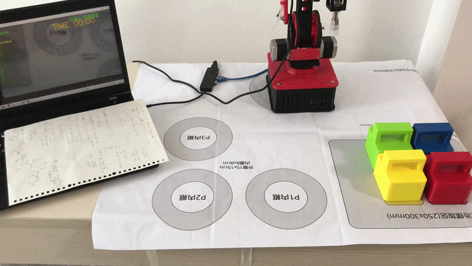
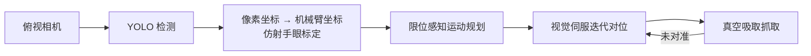
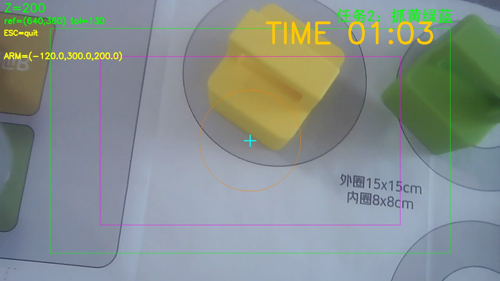
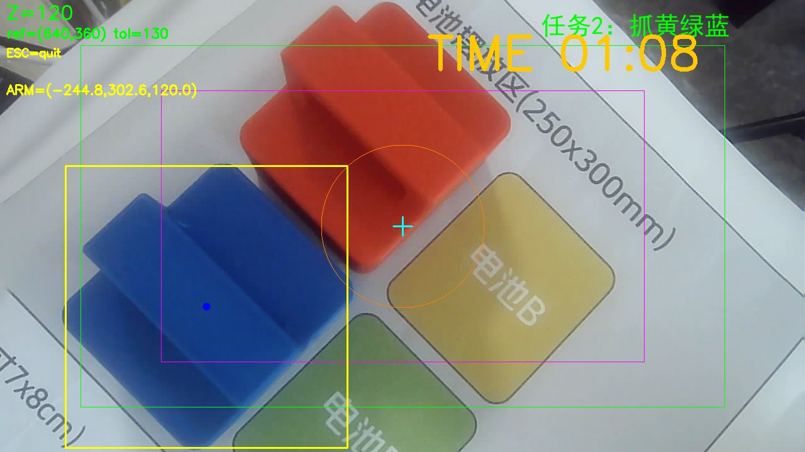
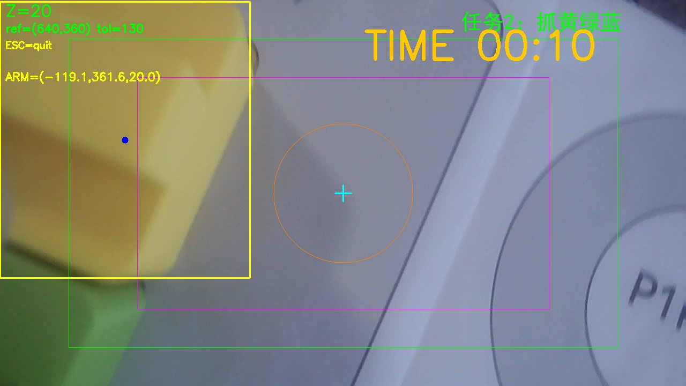

# Robot-Arm-Pick-Place
# Yolo-Gcode

基于视觉引导的机械臂抓取系统 · YOLO 目标检测 + 手眼标定 + 限位感知运动规划

> 机器人竞赛项目 · 比赛结果未公布，算法代码暂不公开
> A closed-loop vision-guided manipulation system: YOLO detection, hand-eye calibration and limit-aware motion planning on a 3-DOF parallel-link arm.

## 系统概览

闭环视觉引导操作系统：

**俯视相机 → YOLO 目标检测 → 手眼标定坐标映射 → 运动规划（含机械臂限位约束）→ 视觉伺服对位 → 真空吸取**

## 实时运行画面

相机画面叠加实时 HUD：检测框、目标圈、机械臂坐标与任务计时。

| 扫描搜索 | 视觉对位 | 下降抓取 |
| :---: | :---: | :---: |
|  |  |  |

## 核心技术

- **YOLO 目标检测** — 自建数据集训练，多类目标识别，置信度阈值可调
- **手眼标定** — 仿射变换 + 分高度段像素-毫米映射表（相机随臂运动、斜视角，不同 Z 下比例不同）
- **限位感知规划** — 将固件球壳限位（双连杆可达空间）建模为软件约束；运动被限位截断时自动保留残差、降低高度借取量程继续逼近
- **视觉伺服对位** — 拍照 → 像素误差 → 坐标变换 → 移动，迭代至目标锁定画面中心
- **实时 HUD** — OpenCV 叠加检测框、目标圈、臂坐标与任务计时，便于调试与演示

## 技术难点与解决

| 难点 | 解决方案 |
| --- | --- |
| 目标位置超出当前高度可达范围 | 沿运动方向二分搜索限位边界，部分执行 + 残差保留，下降后继续 |
| 远离标定中心时视觉误差增大 | 多帧重试 + 小步迭代收敛，逐步修正而非一步到位 |
| 对位耗时长（初版 ~20s） | 参数化仿真分析瓶颈（拍照次数 / 步长 / 限位交互），优化后 **~6s** |
| 相机刷新抖动导致误丢目标 | 连续多帧检测重试机制 |

## 技术栈

`Python` · `OpenCV` · `Ultralytics YOLO` · `PySerial（G-code 运动控制）` · `NumPy`

